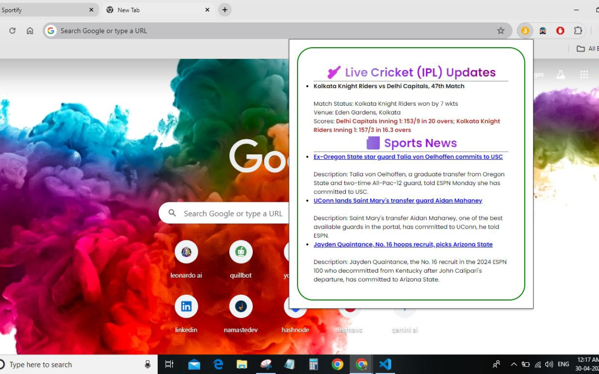
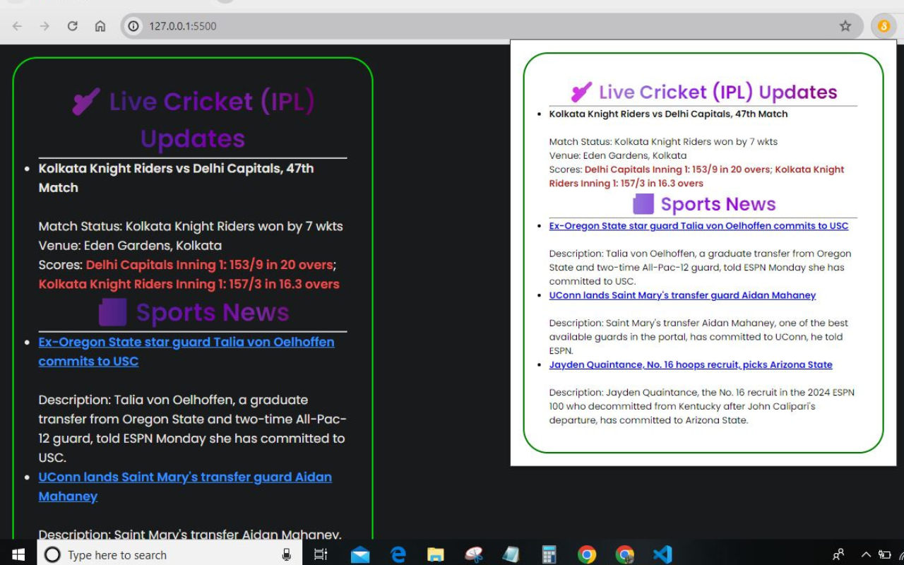

# Sportify--chrome-extension

**Overview:**
Sportify is a Chrome extension providing live cricket scores and the latest sports news. Stay updated with real-time match details and recommended sports articles.

**Screenshots:**

**Features:**
- Real-time updates on cricket matches.
- Comprehensive match details including scores and venues.
- Curated sports articles for enthusiasts.
- User-friendly interface for easy navigation.
- Constant updates for improved functionality.

**Available on Chrome Web Store:**  
[Install Sportify](https://chromewebstore.google.com/detail/mgjahdmijkjbecnobbgpkldenchhfcjn)

**File Structure:**
- `manifest.json`: Contains the metadata and configuration for the Chrome extension.
- `index.html`: The main HTML file that serves as the new tab page.
- `style.css`: The CSS file for styling the new tab page.
- `script.js`: The JavaScript file for fetching and displaying live scores and news.
- `favicon128128.png`: The icon for the extension.

**API References:**
- **CricAPI:** Used to fetch live cricket scores.
  - **Endpoint:** `https://api.cricapi.com/v1/currentMatches`
  
- **TheNewsAPI:** Used to fetch the latest sports news.
  - **Endpoint:** `https://api.thenewsapi.com/v1/news/top`

**Usage:**
Once installed, Sportify will replace your new tab page with its dashboard. You can view live cricket scores and the latest sports news directly from the new tab.

- **Live Cricket Updates:** Displays current IPL match scores and details.
- **Sports News:** Shows the latest sports news articles with links to the full stories.

Install Sportify now to improve your sports browsing experience!!
